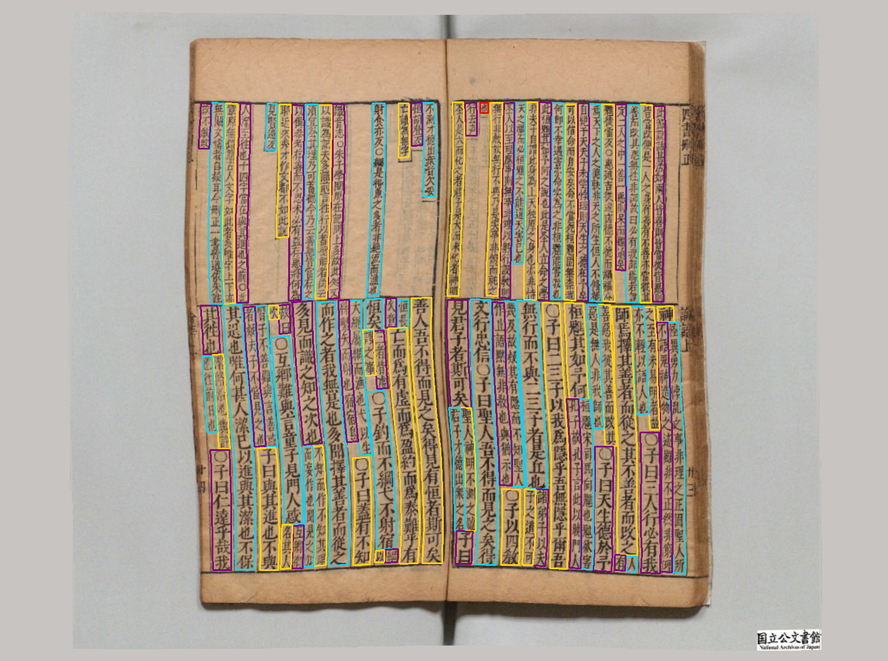
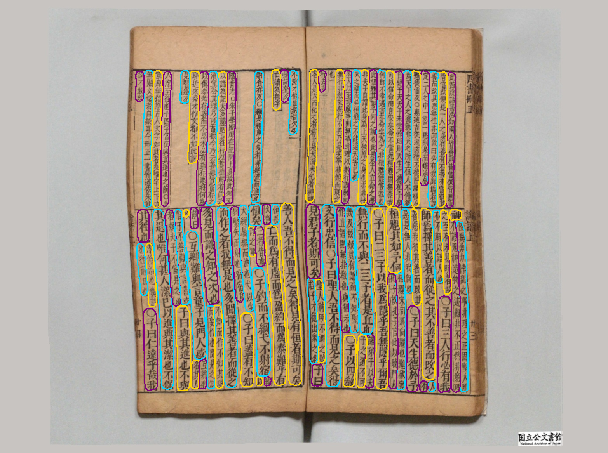

# (ICDAR 2024) SegHist: A General Segmentation-based Framework for Chinese Historical Document Text Line Detection

**Official implementation based on [MMOCR](https://github.com/open-mmlab/mmocr) for paper "SegHist: A General Segmentation-based Framework for Chinese Historical Document Text Line Detection".**

## 🔍 **Examples**

|                             |                                 |
| --------------------------- | ------------------------------- |
|  |  |
|                             |                                 |

## 📄 Abstract

Text line detection is a key task in historical document analysis facing many challenges of arbitrary-shaped text lines, dense texts, and text lines with high aspect ratios, etc. In this paper, we propose a general framework for historical document text detection (SegHist), enabling existing segmentation-based text detection methods to effectively address the challenges, especially text lines with high aspect ratios. Integrating the SegHist framework with the commonly used method DB++, we develop DB-SegHist. This approach achieves SOTA on the CHDAC, MTHv2, and competitive results on HDRC datasets, with a significant improvement of 1.19% on the most challenging CHDAC dataset which features more text lines with high aspect ratios. Moreover, our method attains SOTA on rotated MTHv2 and rotated HDRC, demonstrating its rotational robustness.

## ⚙️ **Requirements**

Installing using config:

```bash
conda env create -f environment.yml
```

Or installing step-by-step:

```bash
conda create --name openmmlab python=3.8 -y
conda activate openmmlab
conda install pytorch==1.12.1 torchvision==0.13.1 torchaudio==0.12.1 -c pytorch
pip install -U openmim
mim install mmengine==0.10.4 mmcv==2.0.1 mmdet==3.0.0 mmocr==1.0.0rc5
```

## 🚀 **Training**

Training DB-SegHist as example (training other model by changing checkpoint):

```bash
python -m torch.distributed.run --nproc_per_node=4 train.py  --launcher pytorch --work-dir work_dirs/ config/seghist/seghist_resnet50-dcnv2_fpnc.py
```

## 🧠 **Inferencing**

```bash
python test.py --work-dir work_dirs/ config/seghist/seghist_resnet50-dcnv2_fpnc.py [your_checkpoint]
```

## 📚 **Acquiring Data**

The data we used can be accessed as follows:

- CHDAC: Contact their [email](iacc_pazhoulab_hp@163.com) or visit their [official website](https://iacc.pazhoulab-huangpu.com/).
- MTHv2: https://github.com/HCIILAB/MTHv2_Datasets_Release
- ICDAR2019: https://tc11.cvc.uab.es/datasets/ICDAR2019HDRC

## 🏆 **Our Results on CHDAC**

| Method                  | P      | R      | F      |
|-------------------------|--------|--------|--------|
| EAST [Zhou et al. 2017] | 61.41  | 73.13  | 66.76  |
| Mask R-CNN [He et al. 2017] | 89.03  | 80.90  | 84.77  |
| Cascade R-CNN [Cai et al. 2018] | 92.82  | 83.63  | 87.98  |
| OBD [Liu et al. 2021]   | 94.73  | 81.52  | 87.63  |
| TextSnake [Long et al. 2018] | 96.33  | 89.62  | 92.85  |
| PSENet [Wang et al. 2019] | 76.99  | 89.62  | 82.83  |
| PAN [Wang et al. 2019]  | 92.74  | 85.71  | 89.09  |
| FCENet [Zhu et al. 2021] | 88.42  | 85.04  | 86.70  |
| DBNet++ [Liao et al. 2022] | 91.39  | 89.15  | 90.26  |
| HisDoc R-CNN [Jian et al. 2023] | _98.19_  | 93.74  | 95.92  |
| **PSE-SegHist (ours)**  | 97.00  | _95.31_ | _96.15_ |
| **PAN-SegHist (ours)**  | 97.52  | 94.77  | 96.12  |
| **DB-SegHist (ours)**   | **98.36** | **95.88** | **97.11** |

*_P_, _R_, and _F_ indicate the precision, recall, and F-measure, respectively, at an IoU threshold of 0.5.

## 🔒 **LICENSE**

This code is distributed under the Apache License. Please note that the datasets we rely on may not be allowed for commercial use.

## 🔗 **CITATION**

TO BE ADDED.
